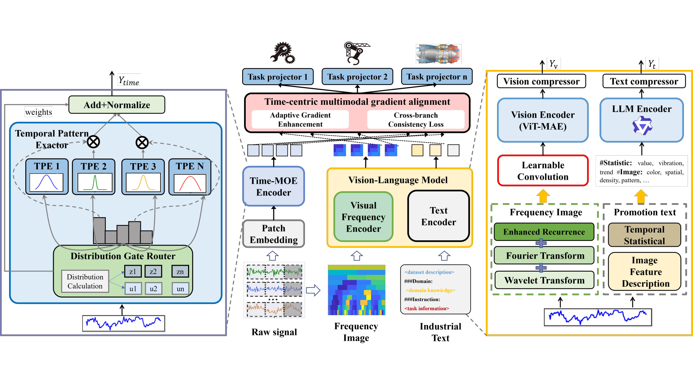
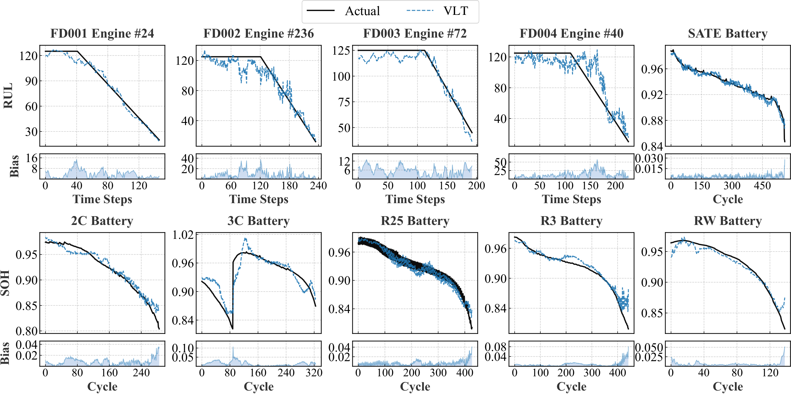
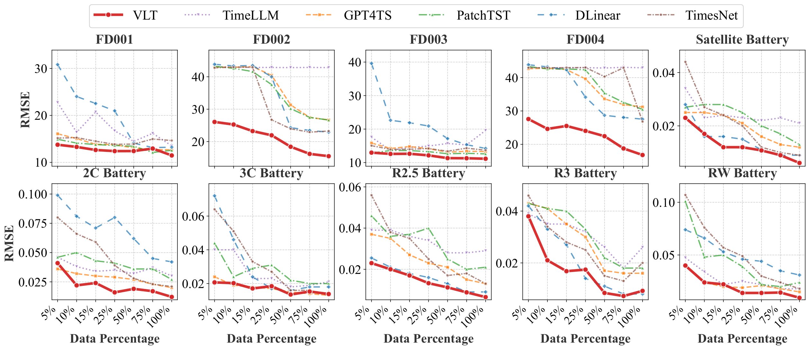
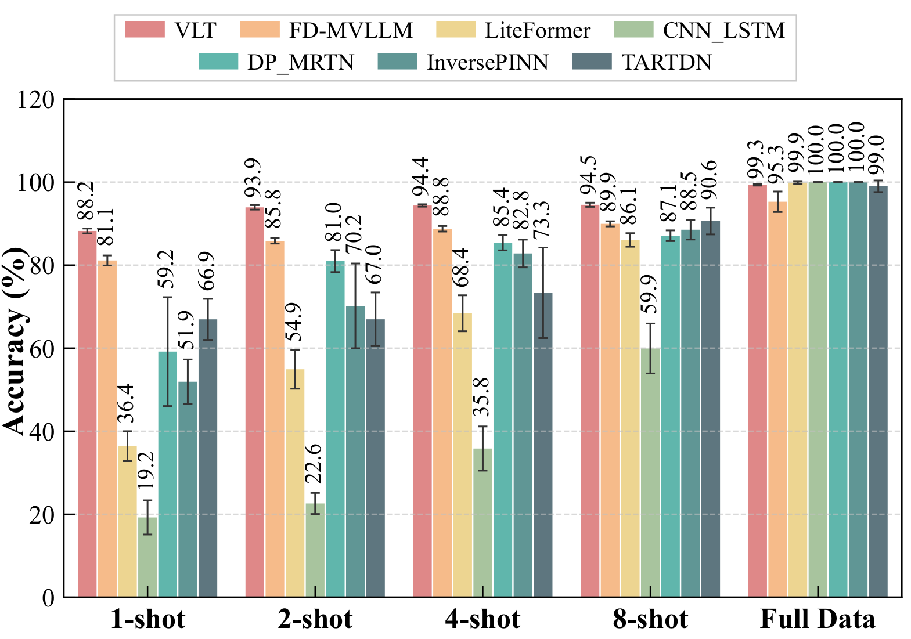
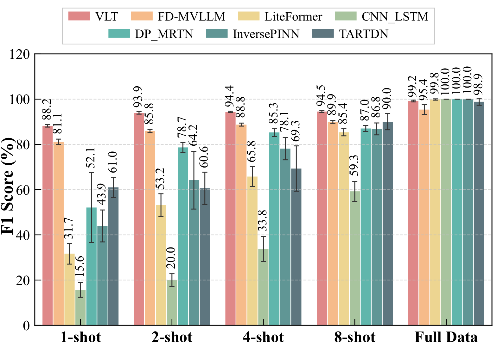
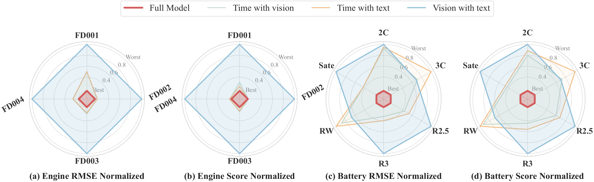
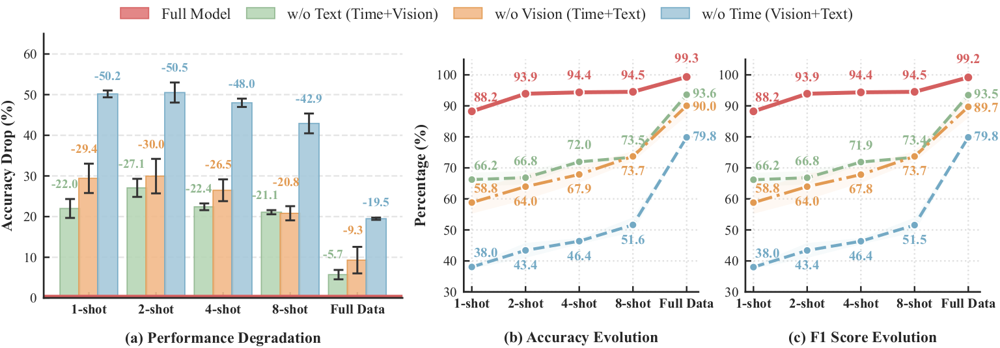
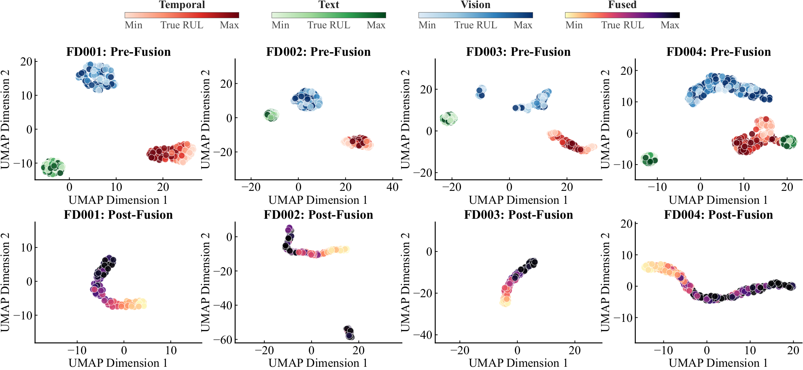
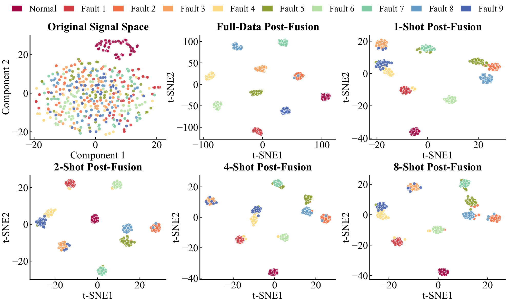

# VLT: A Vision-Language-Time Series Multimodal Foundation Model for Industrial Intelligence

<p align="center">
  <strong>Official repository for the VLT paper</strong>
</p>

<p align="center">
  Paper: coming soon &nbsp;|&nbsp; Code and checkpoints: coming soon
</p>

<p align="center">
  <a href="https://orcid.org/0000-0002-7316-3607">Haiteng Wang</a><sup>*</sup>,
  <a href="https://orcid.org/0009-0002-8844-402X">Jingheng Yan</a><sup>*</sup>,
  <a href="https://orcid.org/0000-0002-0981-6204">Xiaokang Wang</a>,
  and <a href="https://orcid.org/0000-0001-6346-6930">Lei Ren</a><sup>†</sup>
</p>

<p align="center">
  Beihang University · Hangzhou International Innovation Institute, Beihang University<br>
  State Key Laboratory of Intelligent Manufacturing System Technology · Zhengzhou University
</p>

<p align="center">
  <sup>*</sup>Equal contribution &nbsp;&nbsp; <sup>†</sup>Corresponding author
</p>

> The implementation and pretrained checkpoints will be released soon.

## Overview

Industrial Prognostics and Health Management (PHM) seeks to understand equipment health from sensor data and support tasks such as remaining useful life (RUL) prediction, battery capacity estimation, and fault diagnosis. Most existing methods rely on a single modality, although real industrial systems contain complementary temporal dynamics, spectral patterns, and domain knowledge.

We propose **VLT**, a vision-language-time series multimodal foundation model for industrial intelligence. VLT jointly models:

- **raw time-series signals** that preserve continuous degradation dynamics;
- **frequency-domain visual representations** that expose recurrence, Fourier, and wavelet patterns;
- **textual domain knowledge** that supplies operating-condition and equipment semantics.

Instead of converting continuous signals into discrete language tokens, VLT uses frequency-spectrum images as a visual bridge between temporal signals and semantic knowledge. A time-centric multimodal gradient alignment mechanism further reduces optimization imbalance between modality branches.

<p align="center">
  
</p>

<p align="center"><em>
The VLT architecture integrates a Time-MoE encoder, a visual frequency encoder, and a text encoder through time-centric multimodal gradient alignment.
</em></p>

## Highlights

- **A new trimodal PHM paradigm.** VLT unifies continuous temporal signals, frequency-domain images, and textual knowledge without forcing time series into language tokens.
- **Time-aware Mixture-of-Experts.** A sparse router selects specialized temporal experts for progressive degradation, abrupt fluctuations, and quasi-periodic dynamics.
- **Frequency-text augmentation.** Recurrence, Fourier, and wavelet features are assembled into pseudo-color images, while statistical and domain information is represented as text prompts.
- **Time-centric gradient alignment.** Adaptive Gradient Enhancement (AGE) and a Cross-Branch Consistency Constraint (CCL) prevent fast-converging branches from dominating multimodal training.
- **Broad industrial evaluation.** Experiments cover 11 tasks from C-MAPSS aero-engines, XJTU batteries, and CWRU bearings, including full-data regression, few-shot learning, cross-domain transfer, ablation, and representation analysis.

## Method

### 1. Unified trimodal modeling

VLT uses three complementary branches and projects their outputs into a shared fusion space.

| Branch | Input | Main component | Role |
|---|---|---|---|
| Temporal | Raw multivariate sensor windows | Time-MoE | Models continuous and heterogeneous temporal dynamics |
| Visual | Recurrence, Fourier, and wavelet maps | ViT-MAE visual encoder | Extracts global spectral and local time-frequency patterns |
| Knowledge | Statistical, visual, and domain prompts | Qwen1.5-0.5B text encoder | Adds semantic context and engineering knowledge |

### 2. Time-aware Mixture-of-Experts

Industrial signals are non-stationary: different samples may exhibit slow degradation, transient spikes, or periodic oscillations. Time-MoE uses a distribution-aware sparse router to activate the most relevant temporal experts for each sample. An expert-balance objective prevents routing collapse and encourages effective specialization.

### 3. Frequency Visual Learner

The visual branch transforms each time-series sample into a pseudo-color image that combines:

- recurrence information for temporal self-similarity;
- Fourier amplitudes for global frequency components;
- wavelet coefficients for localized time-frequency patterns.

A pretrained masked autoencoder then extracts a compact visual representation that complements the raw temporal features.

### 4. Knowledge Learner

The knowledge branch constructs natural-language prompts from time-series statistics, visual descriptions, equipment information, and operating conditions. A lightweight language encoder maps these prompts into semantic embeddings. This branch augments, rather than replaces, the raw time-series representation.

### 5. Time-centric multimodal gradient alignment

The temporal, visual, and knowledge embeddings are combined by modality attention and time-centered cross-modal attention. VLT addresses modality imbalance with:

- **Adaptive Gradient Enhancement (AGE):** normalizes auxiliary-branch gradients against the temporal branch and strengthens updates for low-confidence modalities;
- **Cross-Branch Consistency Constraint (CCL):** aligns the predictive behavior of temporal, visual, and knowledge branches;
- **two-stage optimization:** first establishes a stable temporal representation, then adapts the visual and knowledge branches under gradient modulation and consistency supervision.

## Experimental Setup

| Dataset | Evaluation scope | Task type | Metrics |
|---|---|---|---|
| C-MAPSS (FD001–FD004) | Aero-engine RUL prediction | Regression | RMSE, Score |
| XJTU Battery (6 subsets) | Battery capacity degradation estimation | Regression | RMSE, Score |
| CWRU Bearing (10 classes) | Few-shot bearing fault diagnosis | Classification | Accuracy, F1 score |

## Main Results

### 1. Stable prediction under complex operating conditions

VLT achieves the lowest RMSE among the compared methods on all four C-MAPSS subsets. Its advantage is especially pronounced on the multi-operating-condition FD002 and FD004 subsets. On the battery benchmarks, VLT obtains the best or near-best results on most subsets.

| C-MAPSS subset | FD001 | FD002 | FD003 | FD004 |
|---|---:|---:|---:|---:|
| VLT RMSE ↓ | **11.47** | **15.50** | **11.15** | **16.59** |

<p align="center">
  
</p>

### 2. Stronger few-shot regression

VLT remains effective when only 5% of the training data is available. It reaches RMSE values of **26.07** on FD002 and **27.57** on FD004, while all compared baselines remain above 42 on both complex subsets. The data-efficiency curves show that multimodal information provides useful additional cues when labeled degradation trajectories are scarce.

<p align="center">
  
</p>

### 3. Effective fault diagnosis with very few labels

On the 10-class CWRU task, VLT reaches **88.23% accuracy** and **88.23% F1** with only one labeled sample per class. With two samples per class, both metrics increase to **93.91%**. The gains are most significant in low-data settings, where pretrained visual-language representations and multimodal fusion provide strong inductive priors.

<p align="center">
  
  
</p>

### 4. Strong cross-domain transfer

When trained on one C-MAPSS domain and directly evaluated on another, VLT obtains the best overall results in both directions.

| Transfer task | RMSE ↓ | Score ↓ |
|---|---:|---:|
| FD001 → FD003 | **15.733** | **442.4** |
| FD003 → FD001 | **13.217** | **238.6** |

### 5. Every modality contributes

Ablation studies show that the temporal branch is the backbone of VLT, while the visual and knowledge branches provide non-redundant gains. In 1-shot CWRU diagnosis, removing the temporal, visual, or textual modality reduces accuracy by **50.2**, **29.4**, and **22.0** percentage points, respectively.

<p align="center">
  
</p>

<p align="center">
  
</p>

### 6. A more structured feature space after fusion

Before fusion, embeddings from different modalities are scattered and overlap heavily. After multimodal fusion, the C-MAPSS feature space forms smooth trajectories aligned with degradation stages. On CWRU, fault classes become clearly separable even under few-shot supervision.

<p align="center">
  
</p>

<p align="center">
  
</p>

## Repository Structure

The code will be organized as follows:

```text
VLT/
├── assets/                  # Figures used in README
├── configs/                 # Experiment configuration files
├── data/                    # Data preprocessing scripts
├── models/                  # VLT model implementation
│   ├── time_moe.py
│   ├── frequency_visual.py
│   ├── knowledge_learner.py
│   └── fusion.py
├── trainers/                # Training and evaluation scripts
├── utils/                   # Utility functions
├── scripts/                 # Running scripts
├── README.md
└── requirements.txt

## Citation

If you find VLT useful in your research, please cite the paper. The public paper link and canonical BibTeX entry will be added after release.

## Contact

For questions, please contact [Haiteng Wang](mailto:wanghaiteng@buaa.edu.cn), [Jingheng Yan](mailto:yjh967@buaa.edu.cn).
